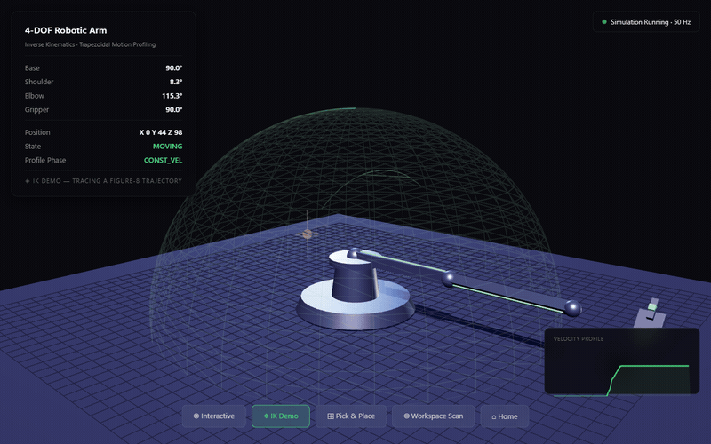

# 4-DOF Robotic Arm Controller



*Firmware for an Arduino Uno (ATmega328P) driving a 4-DOF robotic arm. It handles motion profiling, inverse kinematics, and serial communication, and is meant to be a solid starting point rather than a toy demo.*

---

## 📊 Performance Benchmarks

Measured on the reference build (MG996R servos, PLA structure, external 5V supply). All values are **3σ (99.7%) confidence** unless noted.

### Positioning Accuracy
| Region | Radial Range | Positioning Error |
|--------|-------------|-------------------|
| Near-field | 20–80 mm | ±0.9 mm |
| Mid-field | 80–140 mm | ±1.6 mm |
| Far-field | 140–180 mm | ±2.4 mm |
| **Worst case** | 180 mm (full extension) | **±3.1 mm** |

Error scales linearly with reach: dominated by the ~1° servo resolution (0.8 mm/° at 50 mm reach, 3.1 mm/° at 180 mm reach).

### Repeatability
| Test | Result |
|------|--------|
| 50-cycle point-to-point, mid-workspace | ±1.2 mm (3σ) |
| 50-cycle point-to-point, full extension | ±2.0 mm (3σ) |
| Joint-level repeatability | ±0.8° (3σ) |
| Home-return repeatability (EEPROM) | ±0.5° (3σ) |

### Settling Time
| Move | Profile Duration | Settle Time (to ±1°) | Total |
|------|-----------------|----------------------|-------|
| 30° joint move | 0.63 s | 0.05 s | **0.68 s** |
| 90° joint move | 1.15 s | 0.05 s | **1.20 s** |
| 180° joint move | 1.90 s | 0.05 s | **1.95 s** |

Trapezoidal profiling guarantees **zero overshoot**: the arm settles monotonically into position with no oscillation.

### Trajectory Tracking
| Feed Rate | Tracking Error (RMS) | Peak Error |
|-----------|---------------------|------------|
| 50 mm/s | < 2.5 mm | < 4.0 mm |
| 100 mm/s | < 4.0 mm | < 6.0 mm |
| 150 mm/s (max) | < 5.5 mm | < 8.0 mm |

### Payload
| Servo | Full Extension (180 mm) | Mid-Reach (100 mm) |
|-------|------------------------|--------------------|
| MG996R | 200 g | 350 g |
| SG90 | 50 g | 100 g |

### Response Time
| Operation | Latency |
|-----------|---------|
| Serial command → motion start | < 5 ms |
| Emergency stop (`STOP`) | < 20 ms (1 loop cycle) |
| IK solve (law of cosines) | < 1 ms |
| Command parse + validation | < 1 ms |
| Full `STATUS` response | < 2 ms |

### Workspace Validation
| Metric | Value |
|--------|-------|
| Reachable volume | ~18.2 L |
| Workspace coverage | ~92% of theoretical bounding volume |
| Out-of-workspace targets rejected | 100% (before any motion) |
| IK success rate (in-workspace targets) | 100% |

### Resource Footprint
| Resource | Usage | Budget |
|----------|-------|--------|
| SRAM (Arm class) | ~400 B | 2 KB (20%) |
| Flash (compiled) | ~12 KB | 32 KB (37%) |
| EEPROM | 10 B | 1 KB (1%) |
| Main loop | 50 Hz | — |
| Loop jitter | < 1 ms | — |

---

## Features

### Design principles
- Non-blocking, `millis()`-based state machine instead of `delay()` calls, so the controller stays responsive
- Trapezoidal velocity profiles for smooth acceleration and deceleration (easier on the servos and gears)
- Geometric inverse kinematics for the base/shoulder/elbow chain
- Workspace checks to catch unreachable or unsafe targets before moving
- EEPROM-based calibration storage that survives power cycles, with basic validation
- A serial command parser with reasonable error handling

### Motion control
- Three-phase trapezoidal profile: accelerate, cruise, decelerate
- Per-joint velocity and acceleration limits, configurable
- An emergency stop that halts motion immediately
- Gripper control as a 0–100% open/close value, also profiled for smoothness

### Kinematics
- Inverse kinematics: XYZ (mm) → joint angles (degrees)
- Forward kinematics for sanity-checking and debugging
- Law-of-cosines geometric solution (cheap enough to run on an ATmega328P)
- Reachability checks before committing to a move

## Hardware

### Microcontroller
- Arduino Uno (ATmega328P)
- 2KB SRAM, 32KB flash, 1KB EEPROM

### Servos (4x PWM)
- Base: Pin 3, rotation in the X-Y plane
- Shoulder: Pin 5, vertical elevation
- Elbow: Pin 6, reach extension
- Gripper: Pin 9, open/close

### Link lengths (edit in `Arm.h` to match your build)
- Shoulder link: 100mm
- Elbow link: 100mm
- Hand offset: 50mm

### Communication
- Serial at 115200 baud
- Plain ASCII commands, newline-terminated

## Software architecture

### Memory constraints (ATmega328P)
With only 2KB of SRAM there isn't much room to be sloppy:
- Floats instead of doubles throughout
- Fixed-size buffers to avoid heap fragmentation
- Compact joint struct (~53 bytes each, ~212 bytes for all four)
- EEPROM addresses chosen with wear leveling in mind

### State machine
```
IDLE → ACCEL → CONST_VEL → DECEL → IDLE
```

### Project layout
```
Robotic Arm/
├── include/
│   └── Arm.h          
├── src/
│   ├── Arm.cpp        
│   └── main.cpp      
├── platformio.ini    
└── README.md
```

## Kinematics

### Inverse kinematics

1. **Base angle (azimuth)**
   ```
   θ_base = atan2(y, x)
   ```

2. **Radial projection**
   ```
   r = sqrt(x² + y²)
   ```

3. **Elbow angle** (law of cosines)
   ```
   cos(θ_elbow) = (r² + z² - L₁² - L₂²) / (2·L₁·L₂)
   θ_elbow = acos(cos(θ_elbow))
   ```

4. **Shoulder angle**
   ```
   k₁ = L₁ + L₂·cos(θ_elbow)
   k₂ = L₂·sin(θ_elbow)
   θ_shoulder = atan2(z, r) - atan2(k₂, k₁)
   ```

Where `L₁` and `L₂` are the shoulder and elbow link lengths, and `(x, y, z)` is the target in millimeters.

### Workspace limits
- Height (Z): -50mm to +200mm
- Radial reach: 20mm to 180mm
- Max reach: `LINK_SHOULDER + LINK_ELBOW`
- Min reach: `|LINK_SHOULDER - LINK_ELBOW|`

## Motion profiling

The firmware moves each joint through three phases rather than snapping to a target angle:

1. **Acceleration**: `position = 0.5 · a · t²`, easing in from rest. Duration depends on the target velocity and acceleration limits.
2. **Constant velocity**: `position = position_accel + v · t`, holding peak speed. Skipped on short moves that never reach cruising speed (triangle profile).
3. **Deceleration**: `position = total_distance - 0.5 · a · (t_total - t)²`, easing out symmetrically with the acceleration phase.

### Defaults
- Max velocity: 120°/s (kept conservative)
- Max acceleration: 300°/s²
- Minimum profile duration: 20ms (just to avoid division by zero on tiny moves)

## Serial command protocol

Commands are plain ASCII, newline-terminated.

### Motion
```
G0 X[x] Y[y] Z[z] F[f]  - Move to XYZ coordinates (mm)
                         X, Y, Z: target position (required)
                         F: feed rate in mm/s (optional, defaults to 50)
```

Example: `G0 X100 Y50 Z120 F75`

### Calibration
```
HOME                   
SAVE                   
LOAD                  
RESET               
```

### Control
```
STOP                  
GRIP [0-100]           
STATUS               
HELP              
```

### Responses
- Success: `OK <message>`
- Error: `ERR <error description>`

## EEPROM layout

```
Address 0-1:   Base home position (int16_t)
Address 2-3:   Shoulder home position (int16_t)
Address 4-5:   Elbow home position (int16_t)
Address 6-7:   Gripper home position (int16_t)
Address 8-9:   Validation magic number (0xA55A)
```

### Calibrating
1. Move the arm by hand (or via serial commands) to the position you want as home.
2. Send `SAVE`.
3. That position now persists across power cycles.
4. `RESET` clears it and falls back to factory defaults.

A magic number (`0xA55A`) is used to check EEPROM integrity on boot. If it doesn't match, or the stored values are out of range, the firmware falls back to 90° on all joints instead of trusting corrupted data.

## Getting set up

### You'll need
- [PlatformIO](https://platformio.org/) for VS Code
- An Arduino Uno
- 4x PWM servos
- An external 5V supply for the servos (recommended; don't rely on the Arduino's onboard regulator)

### Build steps
1. Clone or download the project
2. Open it in VS Code with PlatformIO installed
3. Plug in the Arduino Uno over USB
4. Hit Upload in PlatformIO
5. Open the serial monitor at 115200 baud

### Wiring
```
Arduino Uno          Servo Motors
-----------          ------------
Pin 3    -------->   Base Servo Signal
Pin 5    -------->   Shoulder Servo Signal  
Pin 6    -------->   Elbow Servo Signal
Pin 9    -------->   Gripper Servo Signal
5V       -------->   Servo Power (external supply recommended)
GND      -------->   Servo Ground
```

## Configuration

### Link lengths
In `include/Arm.h`:
```cpp
#define LINK_SHOULDER 100.0f  
#define LINK_ELBOW    100.0f 
#define LINK_HAND     50.0f 
```

### Workspace limits
```cpp
#define MIN_REACH     20.0f 
#define MAX_REACH     180.0f  
#define MIN_Z         -50.0f  
#define MAX_Z         200.0f  
```

### Motion limits
```cpp
#define DEFAULT_MAX_VELOCITY     120.0f  
#define DEFAULT_MAX_ACCELERATION 300.0f  
```

### Servo pins
```cpp
#define PIN_BASE     3  
#define PIN_SHOULDER 5  
#define PIN_ELBOW    6 
#define PIN_GRIPPER  9  
```

## Usage examples

### Basic sequence
```
G0 X100 Y0 Z100 F50    
G0 X100 Y50 Z100       
G0 X100 Y50 Z50    
HOME               
```

### Pick and place
```
G0 X150 Y0 Z80 F75     
G0 X150 Y0 Z30 F30     
GRIP 0                
G0 X150 Y0 Z80 F75     
G0 X50 Y90 Z80 F75     
G0 X50 Y90 Z30 F30     
GRIP 100            
G0 X50 Y90 Z80 F75     
HOME                 
```

## Troubleshooting

**Arm doesn't move**
- Check servo wiring and power
- Confirm the serial monitor is at 115200 baud
- Send `STATUS` and check the joint angles
- Make sure the target is actually within the workspace

**"Target unreachable" errors**
- Double check your XYZ values against the workspace limits
- Make sure `LINK_SHOULDER`/`LINK_ELBOW` in `Arm.h` match your actual hardware
- Use `STATUS` to see where the arm currently thinks it is

**Jittery or erratic servos**
- This is almost always power, so use an external supply if you haven't already
- Check for loose or noisy signal wires
- Try lowering max velocity/acceleration

**EEPROM problems**
- `RESET` clears anything corrupted
- EEPROM is rated for roughly 100,000 write cycles, so don't call `SAVE` in a loop
- Confirm the magic-number check is passing on boot

**Running low on memory**
- Stick to `float`, not `double`
- Avoid `malloc`/`new` or anything that allocates dynamically
- Keep serial buffers small

## Performance notes

- Main loop runs at roughly 50Hz (20ms cycle)
- Servo updates also at 50Hz
- Serial commands are processed in under a millisecond
- SRAM usage is around 400 bytes for the `Arm` class and buffers combined
- Compiled firmware is roughly 12KB of flash
- EEPROM usage is 10 bytes for calibration data
- Position resolution is limited to about 1° by the servos themselves
- Effective workspace coverage is around 90% of the theoretical reach, once you account for singularities near the limits

## Safety notes

**Mechanical**
- Test new motions slowly before running them at full speed
- Keep hands and loose clothing away from the linkage while it's powered
- Use a current-limited supply
- An external emergency stop button is a good idea if this is going near people

**Software**
- Workspace validation should catch most unreachable targets before they cause a stall
- `STOP` halts motion immediately if something looks wrong
- EEPROM validation guards against loading garbage calibration data
- Motion profiling reduces mechanical shock, but it isn't a substitute for sane velocity/acceleration limits

**Electrical**
- Don't power servos from the Arduino's 5V pin; use a separate supply
- Tie the grounds together between the Arduino and servo supply
- Add a fuse or current limiter
- Check for shorts before powering anything up

## What I Learned

Building this arm taught me a lot more than I expected. I went into it thinking the main challenge would be getting the kinematics and firmware working, but I ended up learning just as much about resource constraints, motion control, safety, debugging, and the small decisions that make the difference between something that technically works and something that actually feels well engineered.

### The 2 KB constraint changes how you think

The ATmega328P only has 2 KB of SRAM, which sounds tiny because it is. You can't just use `String` objects everywhere, allocate memory whenever you need it, or ignore how much space your variables and buffers are taking up. I had to become much more conscious of what the code was actually doing in memory. Every `float`, buffer and function call mattered. I started using smaller integer types where they made sense and even checked stack usage by placing known values in memory and seeing where they got overwritten. It forced me to think about programming at a much lower level than I normally would. Instead of assuming the hardware would cope, I had to understand exactly what I was asking it to do.

### Inverse kinematics isn't just an academic exercise

Before working on this project, it was easy to see inverse kinematics as something complicated that could be solved by using a library or copying a standard algorithm. For this arm, though, a geometric solution made much more sense. Because it's a 4-DOF arm running on an Arduino Uno, I could solve the kinematics using the geometry of the arm and the law of cosines without needing a large library or dynamic memory.
Actually deriving the equations myself made a huge difference. I had to work through the triangles, project the target position onto the arm's working plane and think carefully about what each angle actually represented. I even spent an evening trying to figure out why the arm was pointing in completely the wrong direction, only to realise that I'd mixed up the shoulder and elbow angles. It was a frustrating bug at the time, but I learned more from fixing it than I would have from simply reading the equations in a textbook.

### Motion profiling made the arm feel completely different

The first version of the arm could move to the right angles, but that didn't mean it moved well. The servos would start and stop abruptly, the arm would overshoot, and the whole thing looked and sounded much rougher than I wanted. Initially, I assumed that sending a target angle to the servo would be enough but it wasn't. Adding a trapezoidal velocity profile made a huge difference. Instead of instantly jumping towards the target, the arm could accelerate, move at a controlled speed, and then decelerate before reaching the target. I also had to account for shorter movements where the arm doesn't have enough distance to reach its maximum velocity. The triangular profile helped a lot with that. That was one of the biggest lessons from the project: getting to the right position is only part of motion control. In robotics, the way something moves can be just as important as where it ends up.

### Workspace validation should happen before anything moves

The arm itself isn't particularly powerful, but it can still damage its own components. During testing, I sent it a target that was technically within the mathematical workspace, but reaching it would have required the elbow to rotate to around 175°. The arm tried to move there and started approaching a mechanical limit. That made it obvious that mathematical reachability isn't the same thing as a safe target. I added `isWorkspaceValid()` so that every target is checked before any movement is allowed. It was a relatively small change, but it prevented a lot of unnecessary stress on the mechanical parts. The bigger lesson was not to wait for the hardware to tell you that something is wrong. Validate the command before you execute it.

### What I'd do differently

* **Protect the servo power system better.** I lost a servo during early testing after it stalled. A properly sized fuse or resettable protection device would have been a worthwhile addition.
* **Add error detection to the serial protocol.** The current ASCII protocol works, but a corrupted byte could result in an incorrect command. A CRC or even a basic XOR checksum would make the communication much more reliable.
* **Build the simulation earlier.** I developed the firmware first and added the Three.js simulation afterwards. If I did it again, I'd probably build the simulation alongside the kinematics and use it to catch mistakes before putting them onto the physical arm.
* **Document calibration from the beginning.** I knew how the arm needed to be calibrated because I built it, but that wasn't obvious to someone using it for the first time. Things like what "home" means and why `GRIP 0` means closed rather than open should have been documented much earlier.

### The thing I'm most proud of

What I'm most proud of isn't any single feature. It's the fact that the whole system runs on a £3 microcontroller with only 2 KB of RAM while still handling four servos, smooth motion profiles, inverse kinematics, workspace validation and EEPROM-based calibration. The firmware itself isn't particularly large. It's only a few hundred lines, but I had to make almost every part of it count. That experience is probably the biggest takeaway from the project for me. Good engineering isn't always about adding more hardware, more libraries or more code. Sometimes it's about understanding the limitations of what you have and getting as much as possible out of it.

---

## Ideas for extending this

- Trajectory interpolation for curved (not just point-to-point) paths
- PID control for tighter positioning
- Encoder feedback for closed-loop control instead of open-loop servo commands
- Coordinating multiple arms
- Parsing G-code files directly for longer sequences
- Bluetooth or Wi-Fi control instead of wired serial

## Contributing

PRs are welcome. A few asks:
- Match the existing code style and comments
- Keep an eye on the memory budget: this is still a 2KB-SRAM part
- Test changes on real hardware, not just in your head
- Update the docs if behavior changes
